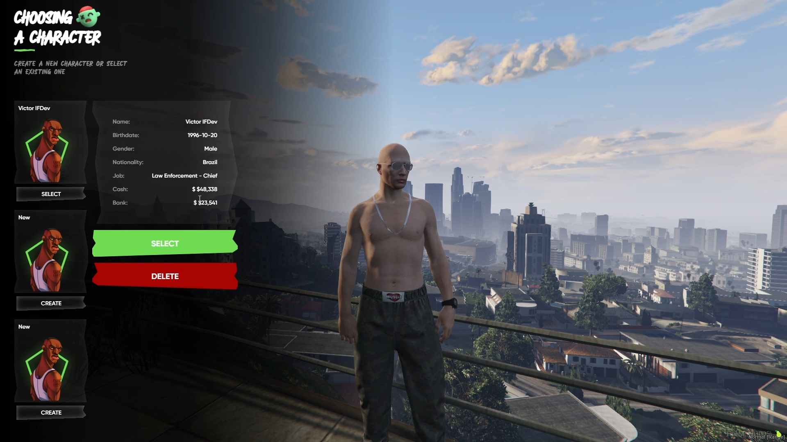
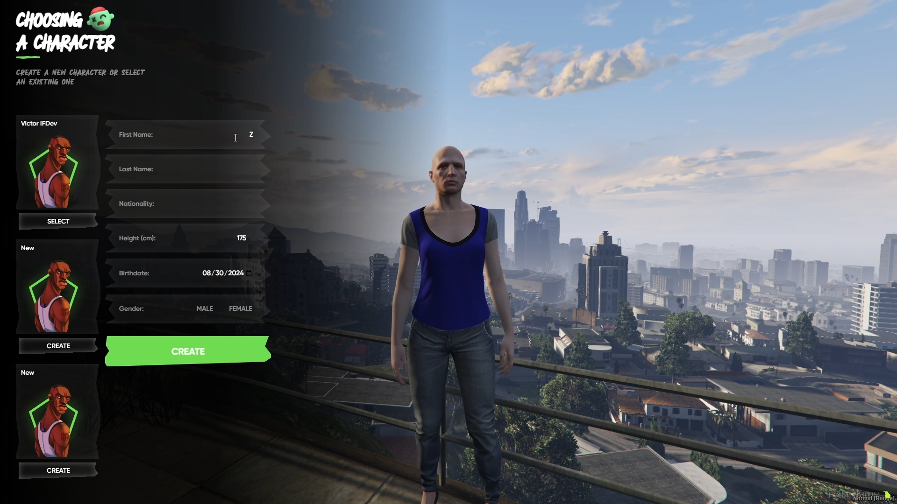

# IF Character Selection UI

## Overview

**IF Character Selection UI** is an open-source, highly configurable, and modular multi-character selection interface designed for the latest versions of ESX and QBCore frameworks. This UI allows players to seamlessly create, select, and manage their characters, offering a clean and modern design.

- [Preview](https://youtube.com/watch?v=yW-TBY9449w)

## Features

- **Character Creation**: Users can create new characters with customizable details such as name, gender, nationality, and more.
- **Character Selection**: Easily select from existing characters with a simple click.
- **Re-login and Char Del**: Users can re-login and delete their characters if enabled at Config.
- **Localization Ready**: Easily translate and adapt to different languages.
- **Simple Integration**: Designed for straightforward integration with ESX and QBCore frameworks, with most of the heavy lifting already done for you.

## Getting Started

### Requirements

- **Framework**: [ESX](https://github.com/esx-framework/esx_core) or [QBCore](https://github.com/qbcore-framework/qb-core) server.

### Installation

1. **Clone or Download the repository:**
   You can download it from [Tebex](https://if-developments.tebex.io/) or here.

2. **Setup:**

   1. Open `config.lua`.
   2. Set your Framework:
      1. For QBCore: Open `fxmanifest.lua` and uncomment the `qb-apartments` import.
   3. Adjust the configuration to suit your needs.
   4. Remove `esx_multicharacter`/`qb_multicharacter` from your server.
   5. Add this script to your `server.cfg` and start it after the Framework Core!

## Support

- Join our [Discord](https://discord.gg/if-developments) and don't hesitate to contact us through tickets.
- You can also create an issue on GitHub, reference it in a ticket, and await our response.

## License

This project is licensed under the GPL-3.0 License - see the [LICENSE](LICENSE) file for details.
